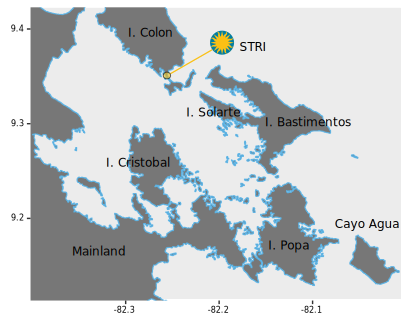

```{r setup, include=FALSE}
library(flexdashboard)
```

Introduction
=====================================  

Column 1 
--------------------------------------------------

###<font size="5">From model organisms to ecosystems: scaling-up our understanding of host-microbe symbiosis in the sea</font> 


December 3--8 2018  
Smithsonian Tropical Research Institute  
Bocas del Toro Research Station  

#####Overview
Animals serve as ecosystems for a suite of bacteria, archaea, viruses and fungi with which they interact in various ways. These host-microbe interactions have played a fundamental role in the diversification, evolution and ecology of all animals on Earth. They may also play a crucial role for the future of biodiversity by mediating the effects of perturbations on individuals and communities of hosts. Considerable knowledge on the underpinnings of microbial symbiosis originates from integrative research programs on model systems (e.g., squid-vibrio, gutless worm), and there is an urgent need to understand if and how these concepts can be generalized across the tree of life.


During this workshop we will summarize and synthesize the current state of our knowledge on the mechanisms and the role of animal-microbe interactions in the sea. As anthropogenic activities affect the dynamics of our oceans, we will discuss how the field can become more unified and predictive. How do we go about understanding the role of environmental stress on host-microbe interactions and the future of marine communities?


The result of these discussions will be summarized into a manuscript that will be submitted for peer-review in an international journal. All participants in the workshop will be invited to participate.

Column 1 
--------------------------------------------------

```{r insert_itol, out.width = "90%"}
# This is to include a static image
bocas <- 
bocas
```

###Venue
The workshop will take place at the Bocas del Toro field station, Smithsonian Tropical Research Institute, Republic of Panama. Bocas del Toro is an archipelago of six main islands and hundreds of mangrove islands of varying size. Dominant shallow water benthic habitats include the red mangrove (*Rhizophora mangle*), seagrass (mainly *Thalassia testudinum*), and coral (e.g., *Porites* spp. &  *Agaricia* spp.). The station is equipped with eight field boats, two field trucks, a full dive facility, numerous lab spaces, microscopy equipment, a seawater facility, and experimental tanks. There are two houses, eight research dorms, a student dorm, and a common kitchen/dinning hall. In addition to primary research activities that encompass both marine and terrestrial systmes, the station hosts  undergraduate and graduate courses as well as taxonomy workshops. 

Transportation, accommodation, and meals will be provided to all participants. Any questions or inquiries about the logistics can be addressed to Fabiola Jenkins (JenkinsF@si.edu) or Jarrod Scott (scottjj@si.edu). 


Important Details 
=====================================  

Column 1 
--------------------------------------------------

###General Info

####Water

<font size="5">Do not drink</font> untreated tap water in Bocas. There are special taps at the station that deliver clean drinking water. <font size="5">Bring a water bottle</font>.

####Money

<font size="5">Cash</font>  rules in Bocas and there is only one ATM on the island. The currency in Panama is the USD. 

####Communication

You can get <font size="5">WiFi</font> in the houses, research dorms, labs, & dinning hall. Occasionally internet service does go out. WhatsApp is a great option for communicating back home & in Bocas. You can also get a local SIM card and a pay as you go data plan at the airport in Panama City or in Bocas. Ask us for more details if you are interested.  

####Climate 

The climate in Bocas is mild. It does <font size="5">rain</font>, sometime a lot. So plan accordingly or just plan on getting wet. You rarely need long sleeves & it doesn't really get too hot. That said,  many of the labs at the station can be quite cool so you may want to pack a hoodie or something else to keep you comfortable when we are inside. 

####Health & Safety in Bocas

Petty crime is the biggest safety concern in Bocas (well that and taxis drive entirely too fast). Be mindful of your belongings and you should be fine. There are many free roaming dogs around town but they are pretty mellow. Something is always under construction so mind your step when you are out and about. All in all, Bocas is generally a peaceful place.

Column 1 
--------------------------------------------------

###Stuff to Bring

We are planning to spend some time in the field exploring local sites. We will be in <font size="5">boats</font>, <font size="5">snorkeling</font>, and <font size="5">scrambling</font> around on shore (possibly in mangroves). If you are not interested in participating in these activities, please let one of the organizers know and we will arrange for an equally awesome alternative activity. To ensure your comfort and enjoyment please consider bringing the following items:

* Mask and snorkel
* Hat
* Water bottle
* Sunscreen
* Crocs, dive booties, Natives, old sneaks, etc.
* Sunglasses
* SPF 50 rash guard or other arm/shoulder protection
* Swim gear
* Camera
* Flip flops/saddles

If you don't have some of these items, like a mask and snorkel, don't worry about it. We will sort you out. 

####Other items

Each dorm room has lockers for your personal effects. Please bring a <font size="5">Pad lock</font> if you would like to use a locker.

Column 1
--------------------------------------------------

###Cuisine & Local Flavors

The province of Bocas del Toro and  surrounding islands are  home to many <font size="5">cacao</font> farms and chocolate makers. You can find cacao in several different forms including bars, nibs, powder, and raw beans. Be sure to talk to **Luis	Mejia** (one of the workshop participants) about *Theobroma cacao*---he is an expert on this amazing plant.

If you like spicy there is some awesome local hot sauce made with <font size="5">aji chombo</font> (*Capsicum chinense*), a fiery Panamanian pepper similar in appearance to a habanero. Typical Panamanian food in not spicy but most restaurants will have some variation of hot sauce made with these peppers that you can slather on your food. 

There are many cool varieties of <font size="5">fruit & vegetables</font> available in Bocas including plantains, papaya, passionfruit, mango, rambutan, and naranjilla. And you can get some pretty dang good <font size = "5">ceviche</font> too.


For all intents and purposes, Panama has two national <font size="5">beers</font>---Panama and Balboa. There are also two different local spirits. Seco Herrerano, distilled from sugar cane, is often mixed with tropical fruits or milk (known as "seco con vaca"). Use at your own risk. More well known is Panama's de facto national rum, Ron Abuelo, which is available in several ages. If you enjoy rum it is definitely worth a try. 


Attendees
=====================================  

Column 1 
--------------------------------------------------

```{r attendee_table}

attend <- read.csv("attendees.txt", header = TRUE, sep = ",", check.names = FALSE)
knitr::kable(attend)
```


Monday {data-navmenu="Schedule"}
=====================================  

Column 1
--------------------------------------------------

### 

#####**Overview**

NEED DESCRIPTION OF WHAT THIS DAY IS ABOUT

Column 4
--------------------------------------------------

### Monday Schedule


####0700-0900 Breakfast 

for those on station. Pastries and coffee for those arriving on the first flight

####0900-1200 Lightning talks 

*Draft schedule*

Half the people will already be at the station while the other half begin arriving at 0730 on. 

#####Brief overview of Workshop

##### Lightning talks STSTTS

(5 minutes/1-2 slides/hold questions until the end) 

* Matthieu Leray 
* Laetitia Wilkins    
* Benedict Yuen        
* Noelle Lucy

######Questions 

*Jarrod picks up the 1000 flight*

* Raquel Peixoto
* David Coil       
* Aaron O’Dea   
* Tiago Pereira 

######Questions & Break

######Station Overview
* Meet Plinio and science staff

######Continue Lightning talks 

* Luis Mejia    
* Robert Thacker (Bob) 
* Douglas Rasher (Doug)    
* Katherine Sharp (Koty)    

######Questions

* Emilia Sogin (Maggie)  
* Lizzy Wilbanks    
* A. Murat Eren (Meren)
* Jarrod Scott

##### Break 

* Presentation about fellowship program (TBD)

* Jonathan Eisen rounds out the morning 

####1200--1330 Lunch

####1330--1630 STRI Talks

* Bill talks about STRI

* Jon Kaye Talks about Moore

15 Min Talks by STRI/SI Scientists (in no particular order yet)

* Emmett Duffy  
* Allen 	Herre  
* Ross Robertson  *Contrasts in the marine environments and biotas across the central American Isthmus*
* Haris Lessios  
* Rachel 	Collin  


* Have a break somewhere between talks

####1700- Happy Hour & Dinner in Town

We will all take a busito to town. Jarrod will get Amy from the Airport at 1800. 


Column 4
--------------------------------------------------

### Outcomes


Tuesday {data-navmenu="Schedule"}
=====================================  

Column 2
--------------------------------------------------

### **Topic 1: Defining & Sampling a Microbiome**

#####**Overview**

In the literature, core microbiomes are defined as assemblages of microbial taxa that are consistently found across individuals of the same species. They form intimate and specialized relationships with their host. In some cases, they are believed to allow their host to use a wider range of habitats (Hernandez-Agreda et al. 2016).
 
#####General Discussion

Are some microbial taxa consistently found across hosts of a community? Are they functionally important or opportunistic taxa? Can some microbes be considered foundation species (i.e., they play an important functional role for many marine hosts)? How to characterize the core microbiome of all hosts within a community (i.e., methodological considerations for comparative approaches)? How do marine hosts acquire this core community? How to account for environmental (oceanographic) factors impacting this core or masking the detection of the core community?

#####Evening Discussion

Discuss sampling strategies from in the field. How to standardize it. Storage and extraction protocols. Do common protocols introduce bias and selection? Which species are missed? Would it make sense to produce guidelines/website/protocols? (Split up into groups for 1h and then report and discuss in plenary for 30min, Laetitia takes notes)

#####References

Column 4
--------------------------------------------------

### Tuesday Schedule


####0700--0830 Breakfast

Jarrod will get Becky from the airport

####0900--0915

Introduction to Topic 1

####0915--1015

Break-out groups 

* A; 2 groups moderated by Jarrod and David **What is a core microbiome?**
* B; 2 groups moderated by Laetitia and Matt **How to characterize the core microbiome?**


####1015--1045 Break

####1045--1115

Report and discuss ideas (two groups: A1 & B1 and A2 & B2)


####1115--1200

Summary and discussion of morning sessions (all; Tiago takes notes)

####1200--1630  

Field trip with lunch in the field

####1630--1730		

Debrief	

####1800--1930 Dinner


####1930--2100	

Evening Discussion


Column 4
--------------------------------------------------

### Outcomes

####**Topic 1**


Wednesday {data-navmenu="Schedule"}
=====================================  

Wednesday
--------------------------------------------------

### **Topic 2: From Defining Patterns to Predicting Drivers of Diversity**

#####**Overview**

The magnitude and frequency of environmental stressors are impacting the dynamics of host microbe interactions. The breakdown of mutualistic relationships can cascade through entire ecosystems with devastating effects on biodiversity and ecological services. Emerging evidence suggests that a set of environmental conditions must be met to initiate the switch from beneficial to detrimental interactions. For example, temperature anomalies beyond some number of days lead to the exclusion of zooxanthellae by host corals. In the case of corals, a well-studied system, symbionts consume too much sugar and get expelled from the host when temperature rises. There is a fine line between mutualism and parasitism.
Existing studies of microbial communities on marine hosts highlight in most cases: 1) a great diversity of microbial partners (i.e., one host - one microbe such as interactions highlight the squid-vibio model are not the norm); 2) some hosts have much more diverse microbiomes than others (e.g., within sponges and corals). The significant of these large differences in diversity is not well understood but microbial diversity (both alpha and beta) might have an import role in host fitness and stability in changing environmental conditions.

##### General Discussion

How to identify the tipping point from symbiosis to dysbiosis in host-associated microbiomes (beyond corals-zooxanthellae)? How to differentiate microbial imbalance from natural variations in microbiomes (e.g., driven by seasonality, changes in diet and life history events)? What is a healthy microbiome? Highlight the importance of characterizing long-term temporal changes in host-associated microbiomes. We can also discuss the importance of building models of host-microbe interactions, like model of ecosystem phase shifts. What needs to be known about the system to build these models? What experiments should be conducted to identify tipping points and on what model systems?
Is a higher richness of microbes beneficial to a host? Do diverse associations promote host fitness and stable holobionts in changing environmental conditions? Borrow concepts of literature on biodiversity-ecosystem functions for metazoans: How is the biodiversity within an ecosystem related to the ecosystem's functions? For microbes, it would translate into: How is the biodiversity of host-associated microbes related to the fitness of a host?

#####References

Column 4
--------------------------------------------------

### Wednesday Schedule


####0700-0830 Breakfast

####0900--0915

Introduction to Topic 2

####0915--1015

* C; 2 groups moderated by Jarrod and Jonathan **What is a healthy microbiome? Does microbial diversity matter for the host? Is more microbes better? Or fewer beneficial symbionts?** 
* D; 2 groups moderated by Laetitia and Matt **How to identify the tipping point from symbiosis to dysbiosis in host-associated microbiomes?**

####10:15--1045

Report and discuss ideas (two groups: C1 & D1 and C2 & D2)

####1045--1115	Break

####1115--1200		

Summary and discussion of morning sessions

####1200--1400	Lunch

####1400--1500		

Break-out groups

* E; 2 groups moderated by Jarrod and Jonathan **Modelling of host-microbe interactions. How do we go from describing the variation to deciphering what is driving it. (F, 1 group moderated by Laetitia): A null model for microbial communities**

* G; 1 group moderated by Matt **Monitoring host-microbe interactions: can we identify model systems or hosts to monitor (e.g., host-microbiomes with cosmopolitan distribution)?**

####1500--1545		

Report and discuss ideas

####1545--1630		Break


####1630--1800		

General discussion How do we progress from surveying the microbiome to modeling it? How do we move from defining variation to figuring out what is driving it? (Tiago, Matt and Laetitia take notes)


####1800- Dinner
 
 After dinner social mixing, relaxing, resting, individual time.

####19:30

For those interested Laetitia will organize a voluntary session on modeling the null model of microbial colonization of a host that night.

We need a theoretical framework that simulates how a Null hypothesis would look like. In the case of microbiomes this is a distribution of microorganisms (in a simple case just 16S reads) on hosts that does not follow any form of coevolution with the host. Just random assemblages that follow rules of colonization, migration, drift and mutation.

Column 4
--------------------------------------------------

### Outcomes

####**Topic 2**


Thursday {data-navmenu="Schedule"}
=====================================  

Column 4
--------------------------------------------------

### **Topic 3: From Predicting Patterns to Conserving Diversity**

#####**Overview**

There is growing concern about the resilience of marine ecosystems. For example, corals, the foundation species of coral reefs, may not be able to acclimate or adapt to ongoing environmental changes. This has stimulated debates about how methods of assisted evolution could be used to help marine ecosystems to retain ecosystem services.
 
Discussion: The inoculation of bacterial communities or strains that can promote the resistance of hosts to stress. Which microbial symbionts influence the host phenotype/fitness (e.g., core microbes, specific strains absent in wild populations?)? At what scale should these measures be taken? And what are the precautions to be taken?

#####References

### **Topic 4: Expanding the breath of host-microbe studies**

#####**Overview**

Our understanding of host-microbe interactions is known in great depth from a very few number of “simple” study systems (i.e., squid-vibrio, lucinid clams, Atlantic killfish, Olavius oligochaete) and a larger number of foundation species (i.e., corals, sponges). Assuming that between 0.3 and 2.2 million metazoan species live in the ocean, our knowledge about host-microbe interactions is based upon 0.03% and 0.004% of all marine host species only (they fall in 5 out of 32 phyla living in the ocean).
 
Discussion: What have we learned from these systems? Why are some systems being studied more than others? On what taxonomic, phylogenetic and functional groups should future studies on symbiosis be focusing and why? Play a game with the group: If you could pick 10 organisms to study, how would you pick them? Why?

How can a system be studied with a more systematic approach? How deep do you have to study a system? Where should we prioritize research?

#####References

Column 4
--------------------------------------------------

### Thursday Schedule

####0630-0730 Breakfast

####0800--1200 

Introduction to  Topic 3

Field trip (Fossils with Aaron O’Dea)

####1200--1300		Lunch

####1300--1345		

Break-out groups (H; 4 groups, moderated by Jarrod, Matt, Laetitia, and David): What can microbiology do for conservation? 

####1345--1415		

Report and discuss ideas (Tiago takes notes)

####1415--1500 Break

####1500--1515		

Introduction to  Topic 4

####1515--1615		

Break-out groups (I; 4 groups moderated by Jonathan, Jarrod, Matt, and Laetitia): On what taxonomic, phylogenetic and functional groups should future studies on symbiosis be focusing and why?

####1615--1700		

Report and discuss ideas (Tiago and Jonathan take notes)

####1700--1800		

Happy hour

####1800--1930		Dinner

####1930--2015		

Talk by Raquel Peixoto on Probiotics/BMMO (title TBA; confirmed)

####2015--2100		

Talk by A. Murat Eren (title TBA; confirmed)


Column 4
--------------------------------------------------

### Outcomes

####**Topic 3 **


####**Topic 4 **


Friday {data-navmenu="Schedule"}
=====================================  

Column 5
--------------------------------------------------

### **Topic 5: Synthesis**

#####**Overview**

#####References

Column 4
--------------------------------------------------

### Friday Schedule


####0700-0830 Breakfast

####0900--1200

Spend the morning drafting outline of paper

####1200--1300 Lunch

Many people leave so we need to figure out best way to spend afternoon. Free time? Could go to Up in The Hill on Basti?

Column 4
--------------------------------------------------

### Outcomes

####**Synthesis**


Arrivals {data-navmenu="Logistics"}
=====================================

Column 1
--------------------------------------------------

### **Wed Nov 28**

**1800**  

<font color="red"><center>**1 Vehicle**</center></font>

* Benedict Yuen
* Laetitia Wilkins

### **Sat Dec 1**

**0730**

<font color="red"><center>**1 Vehicle**</center></font>

* Aaron O'Dea

Column 2
--------------------------------------------------

### **Sun Dec 2**

**0730**

<font color="red"><center>**1 Vehicle**</center></font>

* Maggie Sogin 

**1530**

<font color="red"><center>**2 Vehicles**</center></font>

* Tiago	Pereira
* Raquel	Peixoto
* David	Coil
* Jonathan	Eisen

**1800**

<font color="red"><center>**1 Vehicle**</center></font>

* Emmett Duffy
* Allen 	Herre

Column 3
--------------------------------------------------

### **Mon Dec 3**

**0730**

<font color="red"><center>**3 Vehicles/Busito**</center></font>

* Murat	Eren
* Lizzy	Wilbanks
* Bob	Thacker
* Doug	Rasher
* Koty	Sharp
* Luis	Mejia
* Harilaos	Lessios
* Rachel 	Collin

**1000**

<font color="red"><center>**2 Vehicles**</center></font>

* Ross Robertson
* Jennifer  McMillan
* Jon Kaye
* Bill Wcislo

**1800**

<font color="red"><center>**Taxi to Dinner** with Jarrod</center></font> 

* Amy	Apprill

Column 4
--------------------------------------------------

### **Tue Dec 4**

**0730**

<font color="red"><center>**1 Vehicle**</center></font>

* Rebecca	Vega-Thurber

Departures {data-navmenu="Logistics"}
=====================================  

Column 1
--------------------------------------------------

### **Tue Dec 4**

**0740**  

<font color="red"><center>**1 Vehicle**</center></font>

* Harilaos	Lessios

### **Wed Dec 5**

**1010**  

<font color="red"><center>**1 Vehicle**</center></font>

* Rachel 	Collin

### **Thur Dec 6**

**0740**  

<font color="red"><center>**1 Vehicle**</center></font>

* Ross	Robertson

Column 1
--------------------------------------------------

### **Fri Dec 7**

**0740**  

<font color="red"><center>**1 Vehicle**</center></font>

* Emmett	Duffy

**1540**

<font color="red"><center>**3 Vehicles/Busito**</center></font>

* Murat	Eren
* Bob	Thacker
* Doug	Rasher
* Koty	Sharp
* Rebecca	Vega-Thurber
* Amy	Apprill
* Jennifer 	McMillan
* Jon 	Kaye

Column 1
--------------------------------------------------

### **Sat Dec 8**

**0740**  

<font color="red"><center>**3 Vehicles/Busito**</center></font>

* Lizzy	Wilbanks
* Raquel	Peixoto
* David	Coil
* Jonathan	Eisen
* Tiago	Pereira
* Aaron	O'Dea
* Allen 	Herre
* Luis	Mejia

**1010**

<font color="red"><center>**1 Vehicle**</center></font>

* Maggie	Sogin 

Column 1
--------------------------------------------------

### **Sun Dec 9**

**1540**  

<font color="red"><center>**1 Vehicle**</center></font>

* Benedict 	Yuen


### **Wed Dec 12**

**0740**  

<font color="red"><center>**1 Vehicle**</center></font>

* Laetitia	Wilkins
* Matt Leray

### Never leaving

* Noelle  
* Jarrod

Room Assignments {data-navmenu="Logistics"}
=====================================  

Column 1
--------------------------------------------------
 
### **Student Dorm**

####Room #1

* Matt Leray & Benedict Jinghao Yuen  


####Room #2

* Haris Lessios & David Coil

Column 1
--------------------------------------------------

### **Research Dorm**
####Room #1 
* Lizzy Wilbanks & Maggie Sogin

####Room #2 
* Koty Sharp & Jenny McMillan

####Room #3 
* Ross Robertson & Tiago Pereira

####Room #5 
* Amy Apprill & Rebecca Vega-Thurber

####Room #6 
* Bob Thaker & Luis Mejia

####Room #7 
* Laetitia Wilkins & Raquel Peixoto

####Room #8
* Murat Eran & Doug Rasher


Column 1
--------------------------------------------------
 
### **Cofrin House**

####Room #1
* Allen Herre & Aaron O'Dea

####Room #2
* Jonathan Eisen 

 
### **Hoch House**

####Room #1
* William Wcislo & Emmett Duffy

*Bill can move to Room #2 when Rachel departs on Wednesday*

####Room #2
* Rachel Collin


### **Playa Tortuga**

* Jon Kaye (*Jarrod will arrange transport*)

