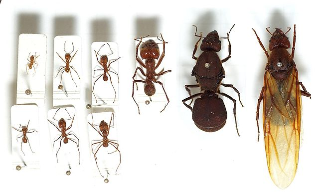
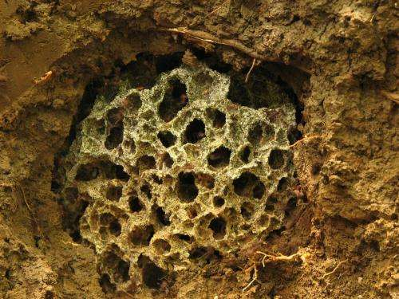
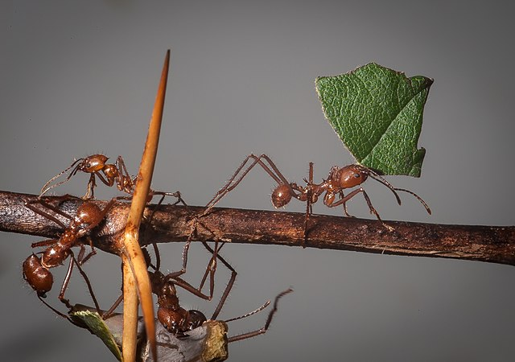
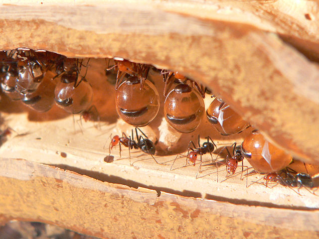
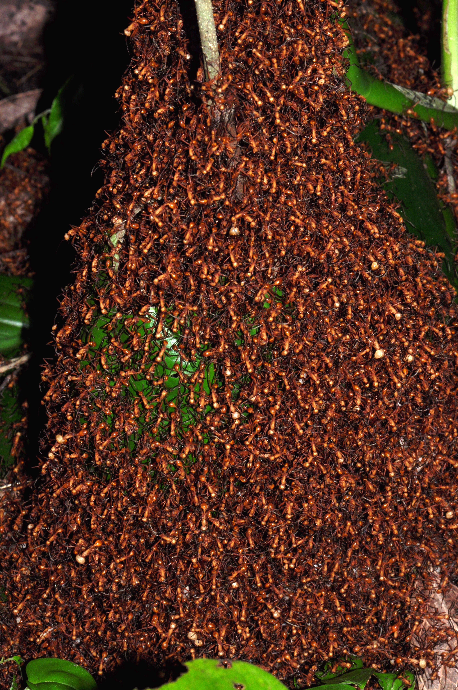

Dear Isabella, 

Thank you so much for you wonderful message. I am sorry  this will be in English, my Spanish is terrible :) But you speak perfect English so we should be ok ;)

I love Ants and I think they are the most spectacular animals on Earth. 

## Some cool facts about ants

Here are some cool things about ants to include in your awesome book. 

* Ants have been on Earth for over 140 million years. That means they have been here for a long time. 
* There are more than 12,000 species of ants in the world today. Thats a lot but not as many as beetles (there are like 500,000 species of beetle). 
* A colony of ants has a queen ant plus worker ants. 
* The queen makes new workers and the workers do all the work.
* A single colony can have up to 3 million ants. Some colonies are very small and have only a few ants. But ants in a colony never live alone. There are always other ants.
* The queen in the colony is the mother and all the workers are her daughters. Male ants are very rare and only used when the queen wants to make more colonies. So when you see an ant walking around it is almost always a girl. 
* Ants are closely related to bees and wasps but ants only fly when they want to make new colonies. Otherwise you will never see an ant with wings. 

## A colony can have many different size ants

Ok, here is another fun thing about ants but we need to use a new word to explain it. The word is **Polymorphism**. Now this looks like a weird word but lets think about the parts of the word. 

**Poly** means many or a lot.   
**morphism** means forms or types. 

So **polymorphism** just means *many forms*. Ants are special because a single colony can have many forms of ants, but they are all sisters. Here is an example:

The big ants on the right are the queen. She is very BIG. All of the other ants are her daughters. They are all different sizes but they are all sisters. No other animal in the world has this many different sizes. 

All the workers in a colony have different jobs. The really small ants care for the babies. The medium sized and gather food. And the ant in the middle (with the big head) protects the colony. 

## What do ants do all day?

Ants do a lot of different things! Here are some of my favorites. 

### Ants that grow food

Do you have a garden at home? Many human beings grown their own food in gardens and farms. Tomatoes, peppers, papayas, mangoes, you name it. Humans grow food so we don't have to walk around the forest all day to find food.  Well there are  ants that grow their own food too! But the ants grow mushrooms (hongos). From Texas in the United States, to Mexico, Panama, and Colombia there are special ants called *Attines* that grow mushrooms in underground garden. Here is what the garden looks like. 

 

All of this white stuff are hongos. To grow the hongos the worker ants go out in the forest and collect leave off of trees. Here are  ants collecting leaves to grow mushrooms.

### Ants that make honey

In the United States there is a very special kind of ant that makes honey. The honey these ants make is what the colony eats. These are called **Honey-pot ants**. That is a great name :) 

Do you see the big orange spheres hanging from the ceiling? Each one of those is the stomach of a worker ant, filled with honey. Think of it this way. In your house you have a shelf in the kitchen that has food. When you get hungry you grab some food off the shelf and eat it. Well the situation is very similar for these ants. The ants with the big stomachs are like the shelf of food in your kitchen. When other ants in the colony are hungry, they just ask the honey ants for some food and everyone is happy.

### Ants that build cool houses

Many ants build their homes underground. Some ants build their home in trees. But one ant makes its home out of other ants!

This is the house of a very special ant called an **army ant**. Army ants are nomadic which means they move around a lot and do not have permanent home. But even army ants get tired from time to time and need to rest. So they build a temporary house out of themselves! Look closely at the picture. Each ant is grabbing the leg of another ant and all together they make a house. Inside the house is the queen (who is very big) and all the babies. 

I hope this gives you a good idea why I like ants. I look forward to hearing your thoughts on ants and other insects. What are your favorite ants? What are your favorite insects?

Bye for now!

Your friend.  
Jarrod

