```{r setup, include=FALSE}
options(htmltools.dir.version = FALSE)
library(knitr)
knitr::opts_chunk$set(warning = FALSE, message = FALSE)
# options(knitr.table.format = "html")
library(tidyverse)
#library(babynames)
#library(fontawesome) # from github: https://github.com/rstudio/fontawesome
library(DiagrammeR)
```

layout: true

---
name: xaringan-title
class: center, bottom, inverse
background-color: #1F4E74
background-image: url(img/panama_dna_50.png)
font-color: white
background-size: contain
background-position: center

# Rethinking the Diversity of Life

<!-- -->

### .fancy[How we (try to)  understand<br/> Connectivity & Diversity in the microbial world ]

a visual exhibit by Jarrod J Scott | STRI | Panama | 2020-01-05

<!-- this ends up being the title slide since seal = FALSE-->

---
name: background
class: left, top
background-image: url(img/land.jpg)
<!-- background-size: cover-->

### A little about me

---

name: background
class: center, middle


## Connectivity of Systems 

## Magnitude of Diversity

## Variety of Forms

### /ʃaː.'riŋ.ɡan/

---
name: connect-intro
class: inverse, center, middle

## Connectivity of Systems 


---
name: iron
class: left, right


.pull-left[
.microbe-dk[Ancient Rock Art  (British Columbia)]

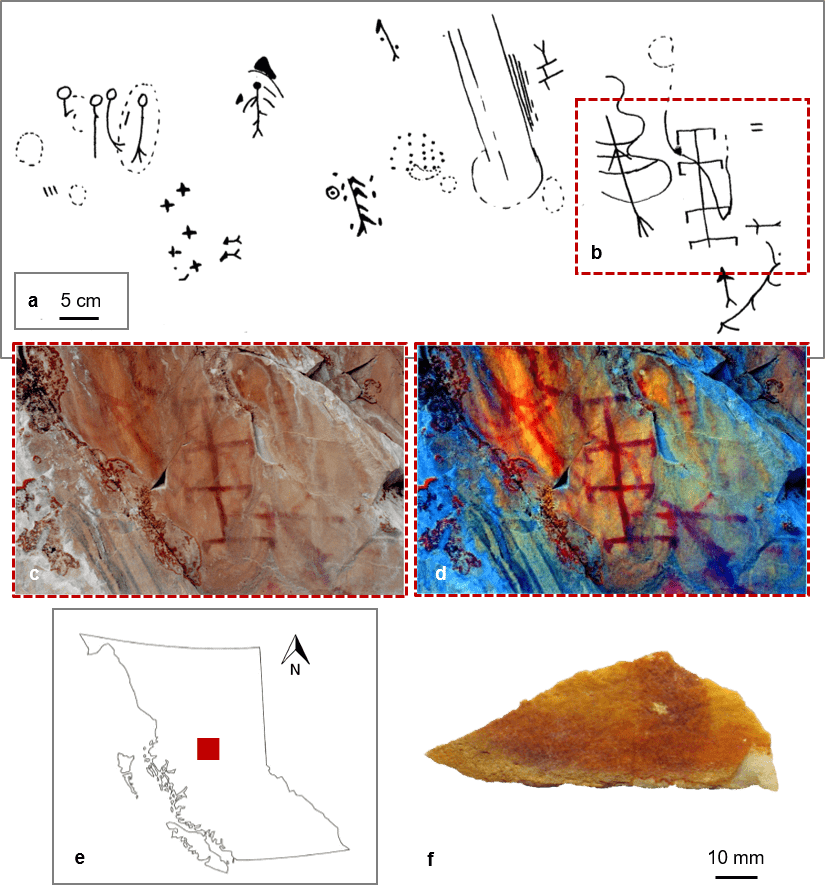
]

--

.pull-right[
.microbe-dk[Deep-sea Hydrothermal Vent (Mariana Back Arc)]

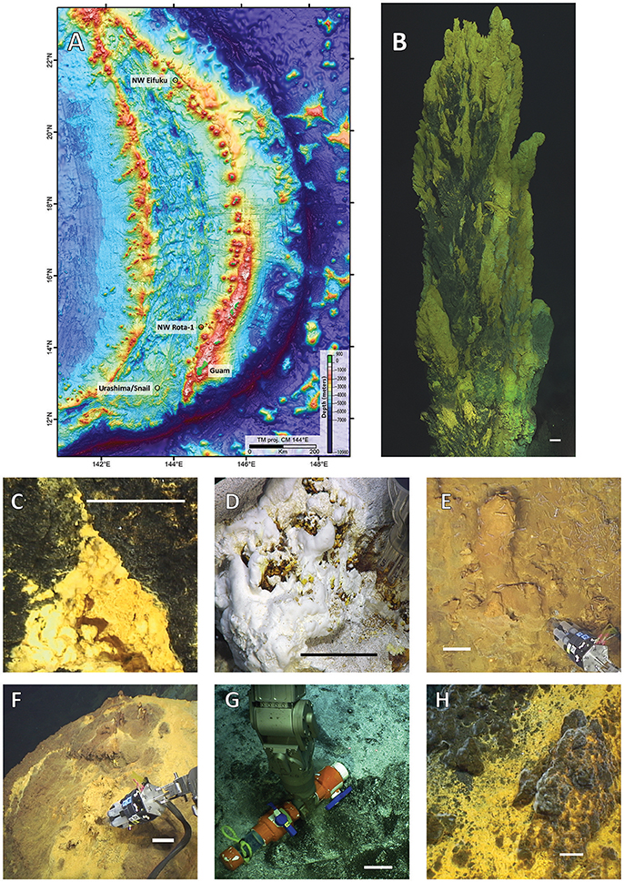
]

---
name: ironoxidizer
.center[
.microbe-dk[Iron-oxidizing bacteria]

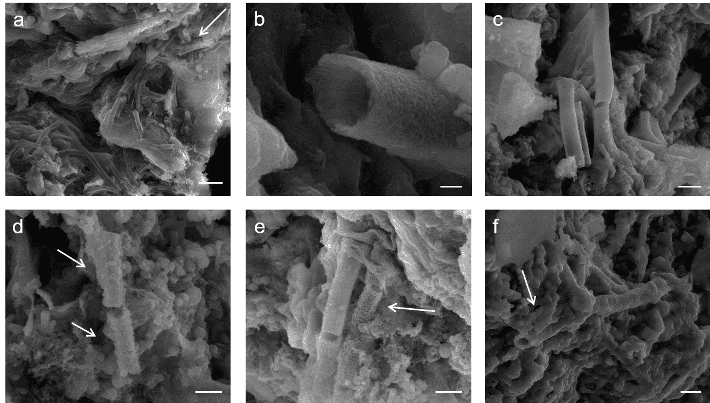
]

---

name: mag-intro
class: inverse, center, middle

## Magnitude of Diversity

---

name: magnitude
class: middle

.pull-left[
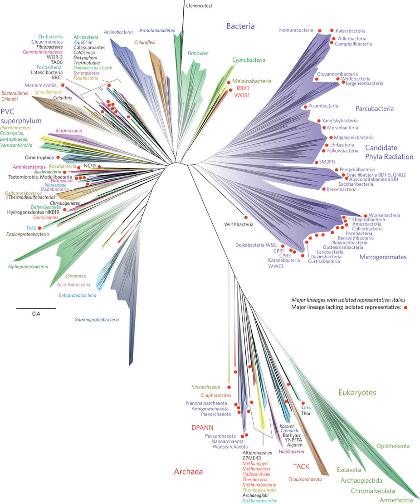
.microbe-dk[Current Tree of Life]
]


.pull-right[
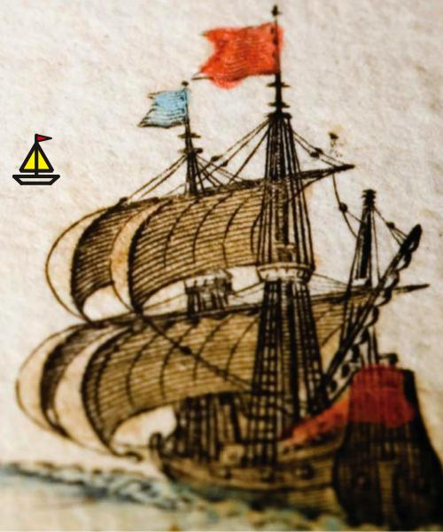
.microbe-dk[Current understanding of that Diversity]
]

---
name: mag-intro
class: inverse, center, middle

## Variety of Forms


---
name: forms
background-color: #000000
class: middle

.pull-left[
.microbe-lt[Abundant & Familiar Forms]

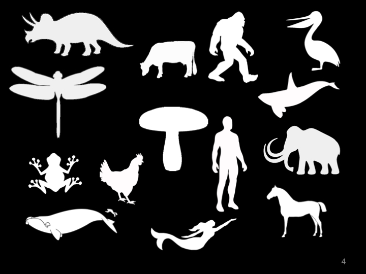
]

--

.pull-right[
.microbe-lt[Limited & Uninformative Forms]

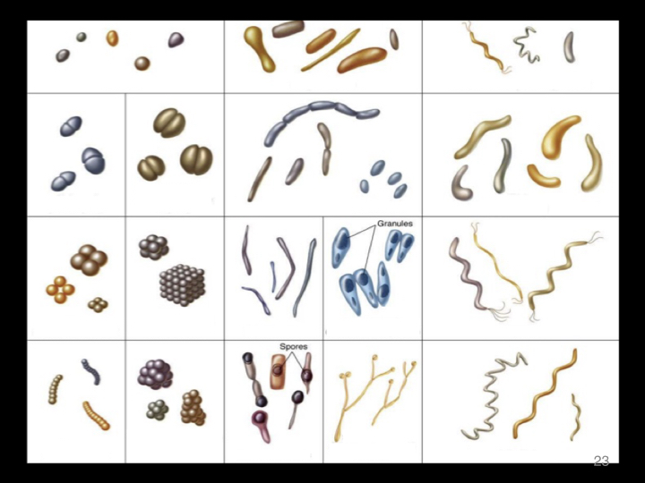
]

---
name: library
class: inverse, center, middle

### An Ecosystem is a Library of Genomes

.microbe-lt[and we want to read all the books]

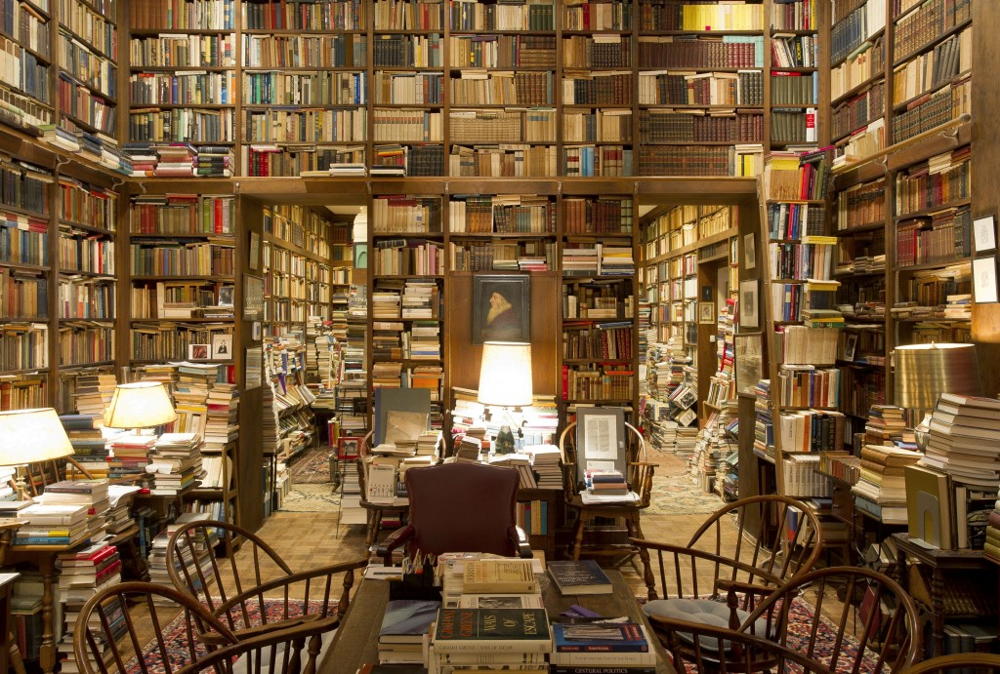
]

---
name: chaos
background-color: #FFFFFF
class: middle, split-four 

.column[
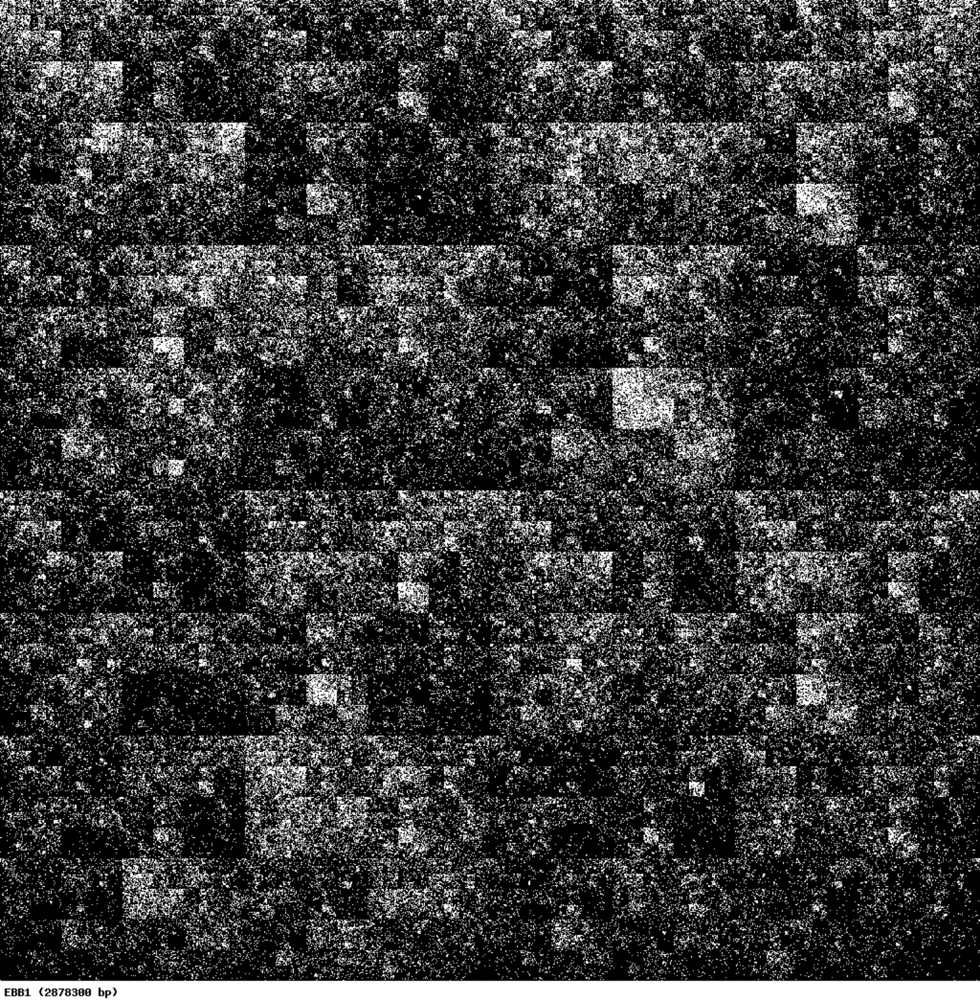
Loihi Seamount

Mariana Back Arc Basin
]

.column[
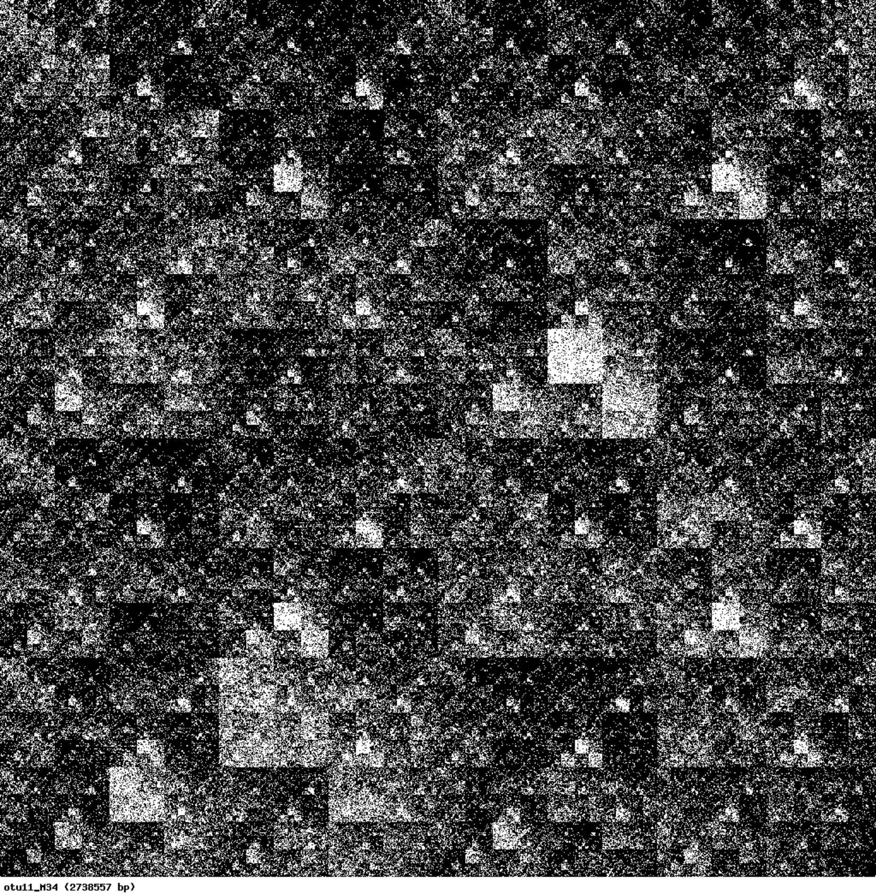
Loihi Seamount
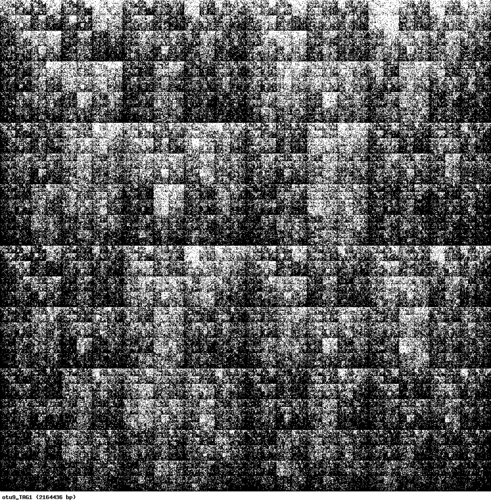
Mid-Atlantic Ridge
]


.microbe-dk[Chaos Game <br/> Maps]

---
name: mag-intro
class: inverse, center, middle

### Emergent Self-Organizing Map

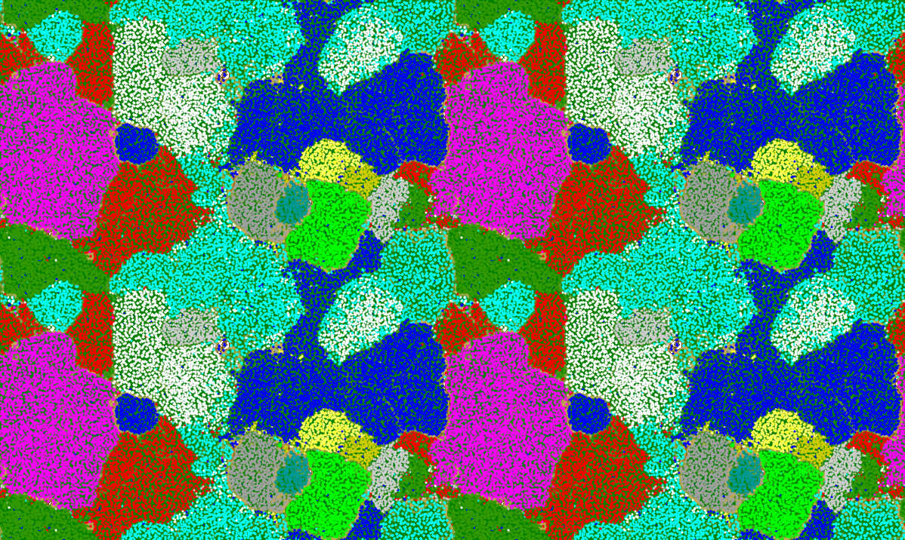

---
name: workflow
class: middle

### From there to here...

.microbe-big-dk[Metagenomics as a tool to explore  hidden microbial dimensions across the Isthmus of Panama]

```{r echo = FALSE, out.width = '100%', out.height = "25%"}
# Create a graph as a left-to-right path
graph <-
  create_graph() %>%
  add_path(
    n = 3, 
    type = "step",
    label = c(
      "Field", "Lab", "Computer"),
    node_aes = node_aes(  # set node aesthetics
      shape = c("rectangle", "rectangle", "rectangle"),
      width = c(1.2, 1.2, 1.2),
      color = "#3C3C3C",
      fontcolor = "black",
      fillcolor = c("#61acf0", "#E69F00",  "#CC79A7"),
      fontname = "Lato"
    ),
    edge_aes = edge_aes(  # set edge aesthetics
      color = "#3C3C3C"
    )
  ) %>%
  add_global_graph_attrs(attr = "layout", value = "dot", attr_type = "graph") %>%
  add_global_graph_attrs(attr = "rankdir", value = "LR", attr_type = "graph")
# View the graph in the Viewer
graph %>% render_graph()
```


```{r echo = FALSE, out.width = '100%', out.height = "25%"}
# Create a graph as a left-to-right path
graph <-
  create_graph() %>%
  add_path(
    n = 6, 
    type = "step",
    label = c(
      "1. Collect\\n Samples", "2. Filter\\n Samples", "3. Extract\\n the DNA",
      "4. Read\\n the DNA", "5. Assemble\\n the DNA", "6. Rebuild\\n Genomes"),
    node_aes = node_aes(  # set node aesthetics
      shape = c("circle", "circle", "circle", "circle", "circle", "circle"),
      width = c(1, 1, 1, 1, 1, 1),
      color = "#3C3C3C",
      fontcolor = "black",
      fillcolor = c("#61acf0", "#61acf0", "#E69F00", "#E69F00", "#CC79A7", "#CC79A7"),
      fontname = "Lato"
    ),
    edge_aes = edge_aes(  # set edge aesthetics
      color = "#3C3C3C"
    )
  ) %>%
  add_global_graph_attrs(attr = "layout", value = "dot", attr_type = "graph") %>%
  add_global_graph_attrs(attr = "rankdir", value = "LR", attr_type = "graph")
# View the graph in the Viewer
graph %>% render_graph()
```

---
name: collecting
class: inverse, center, middle

### N<sup>o</sup>1 Collect samples

.pull-left[
.microbe-lt[Coral Reef Habitat]

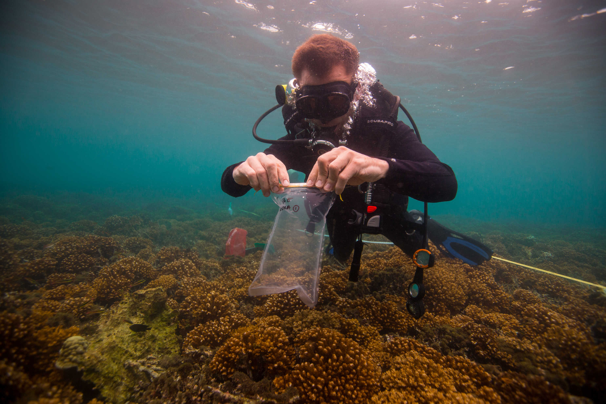
]

.pull-right[
.microbe-lt[Mangrove Habitat]

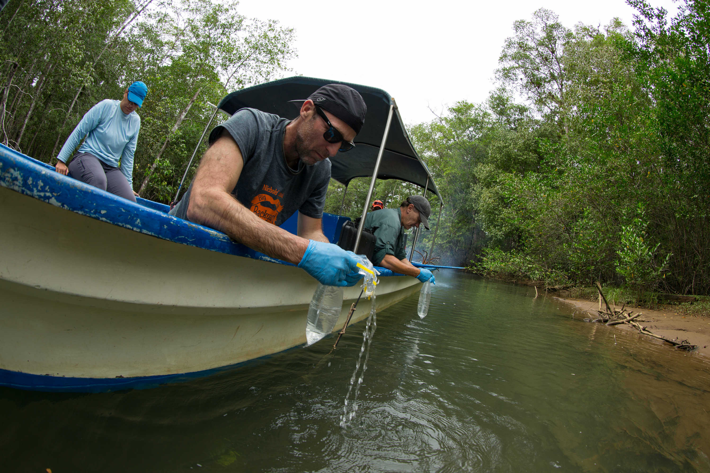
]

---
name: filtering
class: inverse, center, middle

### N<sup>o</sup>2 Filter samples

.pull-left[
.microbe-lt[Pour]

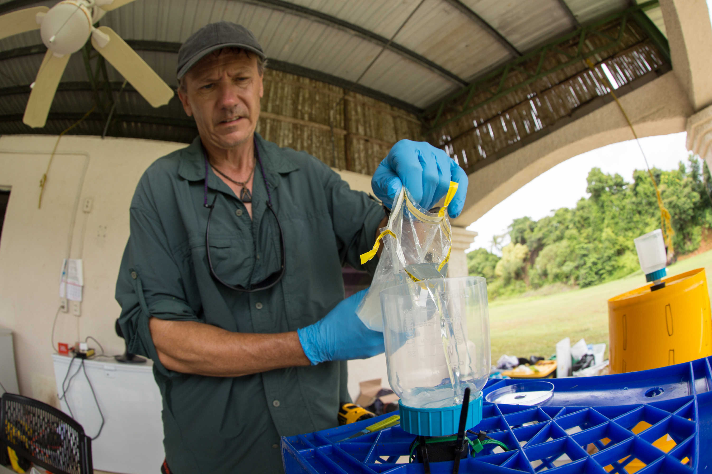
]

.pull-right[
.microbe-lt[...and Drill]

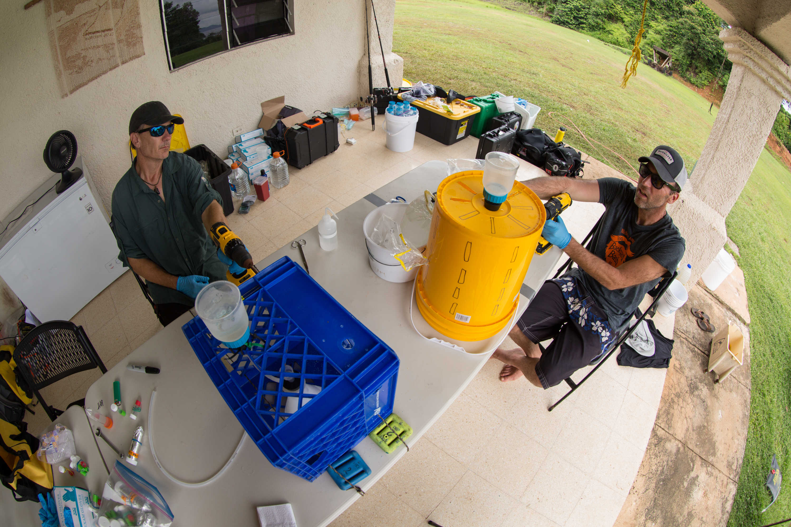
]

---
name: shred
class: inverse, center, middle

### N<sup>o</sup>3 Extract & N<sup>o</sup>4  Read the DNA 

.pull-left[

]


.pull-left[
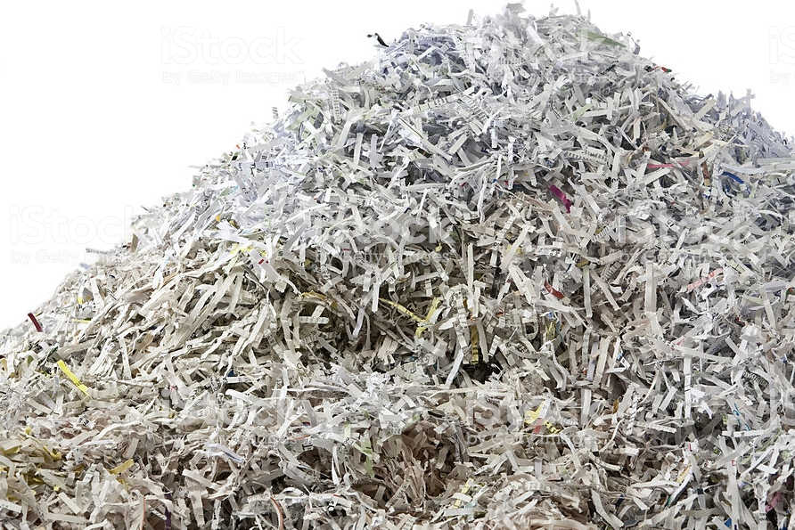
]


---
name: dag
class: center, middle

### N<sup>o</sup>5 Assemble the DNA & N<sup>o</sup>6  Rebuild Genomes

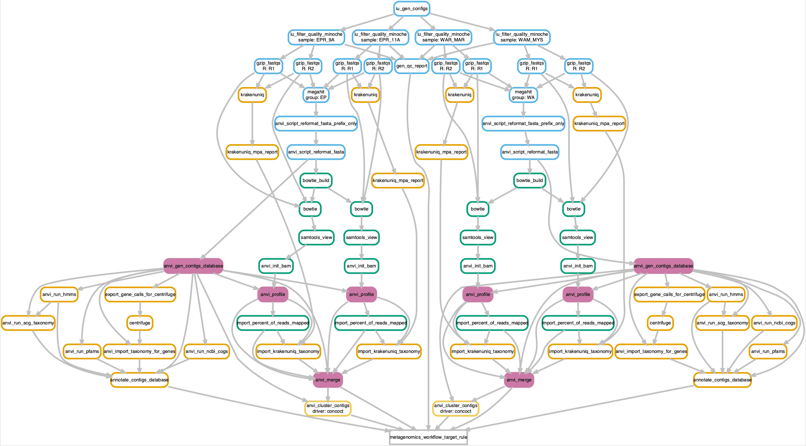


---
name: end
class: center, middle, inverse
background-color: #1F4E74
background-image: url(img/panama_dna_50.png)
font-color: white
background-size: contain
background-position: center

# Rethinking the Diversity of Panama


