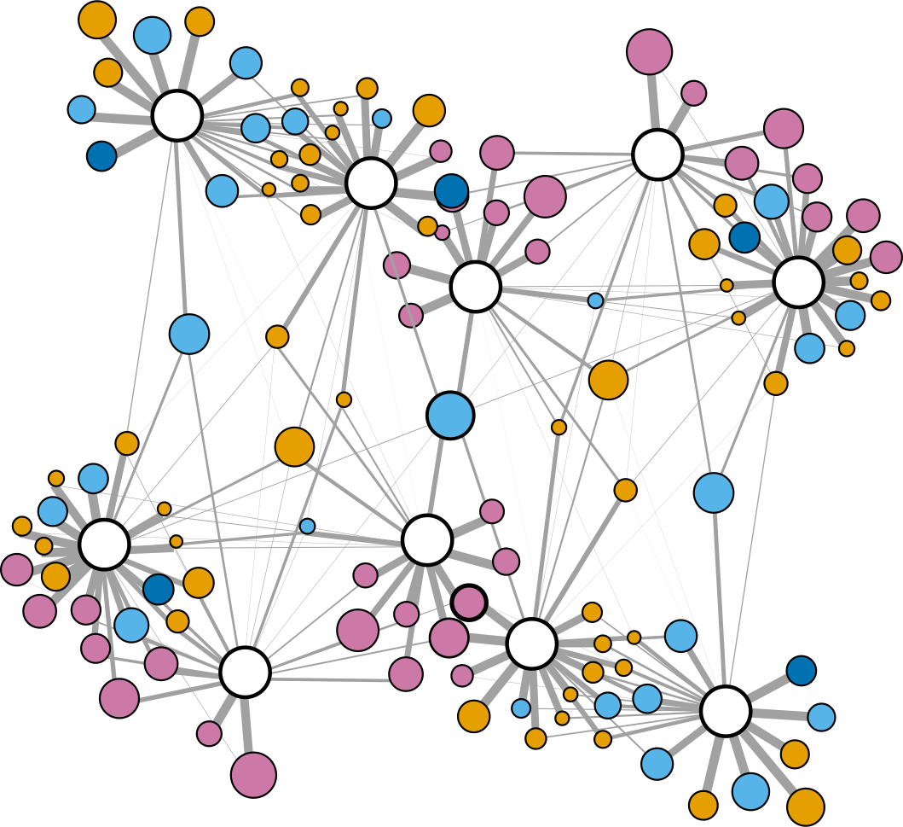

```{r echo=FALSE}
library(fontawesome)
```


Aside
================================================================================

<div class="zoom"></div>
 
<br/>

<i class="fa fa-download"></i><a href="https://github.com/istmobiome/istmobiome.github.io/raw/master/jarrod/jarrod-cv.pdf" download="jarrod-cv.pdf"> Download a PDF of this CV</a>

<i class="fa fa-globe"></i><a href="https://istmobiome.github.io/jarrod/jarrod-cv.html"> Web version of CV</a>


Contact Info {#contact}
--------------------------------------------------------------------------------

- <i class="fa fa-envelope"></i> jarrod.jude.scott@gmail.com
- <i class="fa fa-github"></i> [github.com/jarrodscott](https://github.com/jarrodscott)
- <i class="ai ai-orcid-square"></i> [ORCID](https://orcid.org/0000-0001-9863-1318)
- <i class="fa fa-globe"></i> [web](https://istmobiome.rbind.io/)


Skills {#skills}
--------------------------------------------------------------------------------

- Marine & terrestrial field work. 

- PADI Rescue Diver certification. 

- Bioinformatics (amplicon, genomic, & metagenomic). [anvi'o](http://merenlab.org/software/anvio/), [DADA2](https://benjjneb.github.io/dada2/), [mothur](https://mothur.org/), [oligotyping](http://merenlab.org/software/oligotyping/), [MED](http://merenlab.org/software/med/), [R](https://www.r-project.org/), [Python](https://www.python.org/). 

- Web Products [R Markdown](https://rmarkdown.rstudio.com/), CSS, HTML, [HUGO](https://gohugo.io/), [blogdown](https://bookdown.org/yihui/blogdown/), [xaringan](https://github.com/yihui/xaringan), [reveal.js](https://github.com/hakimel/reveal.js/), [pagedown](https://github.com/rstudio/pagedown). 

- Fire Fighter I & II certification.

- Knots


Main
================================================================================

Jarrod J. Scott {#title}
--------------------------------------------------------------------------------

### an old-school naturalist using new-school tech

I study [microbial diversity](#pubs).  My approach is holistic, spanning [marine](#marine) & [terrestrial](#land) systems to understand  how simple organisms coalesce into  complex communities  & how these communities affect host biology, biogeochemical cycles, & ecosystem-level processes. I work to make research more accessible & exciting, transparent & reproducible. I use & teach open-source tools to create [web products](#web) that communicate science more effectievly. 

Current Appointment {data-concise=true}
--------------------------------------------------------------------------------

### STRI/Moore Foundation Postdoctoral Fellow

Smithsonian Tropical Research Institute

Panama

2017 - 

- Microbial ecology of coral reefs & mangrove ecosystems across the Isthmus of Panama. The Eastern Pacific & Western Atlantic.

Education {data-icon=graduation-cap data-concise=true}
--------------------------------------------------------------------------------

### PhD Microbiology

University of Wisconsin--Madison

Madison, Wisconsin USA

2011 - 2006 

### BSc Aquatic Biology, Minor in Archaeology

University of Texas--Austin

Austin, Texas USA

2002 - 1998


Prior Research Positions {data-icon=compass}
--------------------------------------------------------------------------------

### Postdoctoral Research Associate

Bigelow Laboratory for Ocean Sciences

East Boothbay, Maine USA

2016 - 2012 

### Graduate Fellow

University of Wisconsin--Madison

Madison, Wisconsin USA

2011 - 2010

### Predoctoral Fellow

Smithsonian Tropical Research Institute

Gamboa, Panama

2010 - 2009

### Research Technician

University of Texas--Austin

Austin, Texas USA

2005 - 2002


Marine Field Experience {data-icon=anchor #marine}
--------------------------------------------------------------------------------

###  Caribbean Field Work

Smithsonian Tropical Research Institute

Bocas del Toro, Panama

2020 - 2017

Extensive field work around the Bocas del Toro archipelago.

###  Research Expeditions to Isla Coiba

Smithsonian Tropical Research Institute

Isla Coiba, Panama

2020 - 2017

5 expeditions over the past 3 years

::: aside
Use [**this link**](https://stri.si.edu/facility/coibita-island) to learn more about Isla Coiba. 
:::


### R/V Revelle & ROV Jason II (cruise RR1413)

[Submarine Ring of Fire - Ironman Cruise](https://www.rvdata.us/search/cruise/RR1413) 

Mariana BackArc Basin

2014

November 23 – December 21

::: aside
All research cruises from 2012 - 2014 were to study the microbial ecology of deep-sea hydrothermal systems, specifically iron-oxidizing  communities.
:::

### R/V Atlantic Explorer (cruise AE1410)

[Chief Scientist Training Cruise](https://www.rvdata.us/search/cruise/AE1410)

Barbados to Bermuda

2014

May 31 – June 10

### R/V Thompson, ROV Jason II, & AUV Sentry (cruise TN293) 

[FeMo Deep Iron Eaters](https://www.rvdata.us/search/cruise/TN293)

Lo'ihi Seamount, Hawaii

2013

March 4 – April 1

### R/V Knorr & ROV Jason II (cruise KN209-02)

[Woods Hole Oceanographic Institution](https://www.rvdata.us/search/cruise/KN207-02)

Mid-Atlantic Ridge

2012

October 16 – November 14

::: aside
I've also worked on a lobster boat in Maine & a seine boat in Alaska.
:::

### R/V Longhorn 

University of Texas-Austin

Gulf of Mexico 


2001


Terrestrial Field Experience {data-icon=truck #land}
--------------------------------------------------------------------------------

### Microbial Ecology of Fungus-Growing Ants

Smithsonian Tropical Research Institute

Panama

2010 - 2008

::: concise
- Four expeditions to Panama 
- 15-month residency at STRI
- Field & lab experiments with fungus-growing ants
:::

::: aside
A lot of my field experience in terrestrial systems is on fungus-growing ants in the Neotropics.
:::

### Biogeography of Fungus-Growing Ants

University of Texas

Mexico & Panama 

2004 - 2001

::: concise
Multiple field expeditions to understand the biogeography of fungus-growing ants & their fungal symbionts. 
:::

### Molecular Ecology of Cichlids in Northern Mexico

University of Texas

Coahuila, Mexico

2001 - 2000

::: concise
Molecular analysis of cichlid fish endemic to aquifer fed pools of the Cuatro Cienegas Basin.
:::

### Mayan Archaeological Surveys

University of Texas

Northwestern Belize 

2000

Extensive surveys & excavations of Mayan archaeological sites in  lowland tropical rain forests. 

Recent Teaching Experience {data-icon=chalkboard-teacher}
--------------------------------------------------------------------------------

### Course Instructor

STRI-McGill Tropical Biology Field Course 

Panama

2020

::: concise
- Guide project design & implementation. 
- Reproducible analytical workflows using R Markdown. 
- Assist with field work.
- Natural history of neotropical marine & terrestrial ecosystems.
:::

Field sites incl. [Barro Colorado Island](https://stri.si.edu/facility/barro-colorado), [Ft Sherman Canopy Crane](https://stri.si.edu/facility/canopy-access-cranes), [Pipeline Road Forests](https://stri.si.edu/facility/gamboa), [Agua Salud](https://stri.si.edu/facility/agua-salud) & [Isla Coiba](https://stri.si.edu/facility/coibita-island). 

::: aside
I teach the way I learn. My goal is to create a venue where students can be curious, get their hands dirty, make mistakes, & explore. I'm here to help students see what's possible, not tell them what to do. 
:::

### Marine Biology Instructor

STRI-McGill Tropical Biology Field Course 

Isla Coiba, Panama

2019

::: concise
- Guide  project design & implementation. 
- Assist with field work.
- Snorkeling class for inexperienced students.
:::

::: aside
[**Click here**](https://strineoigert.wordpress.com/) for the course blog & [**here**](https://www.mcgill.ca/pfss/) for the course website. 
:::

Web Products {data-icon=globe data-concise=true #web}
--------------------------------------------------------------------------------

### [Hypocolypse](https://hypocolypse.github.io/)

Hypoxia driven coral bleaching & microbial shifts in Caribbean Panama.

Bocas del Toro, Panam

2020

::: aside
Reproducible Workflows
:::

### [Istmobiome Project](https://istmobiome.rbind.io/)

Reproducible bioinformatic workflows for the Istmobiome microbiome project. (*work in progress*)

Panama

2020

### [ProjectDIGEST](https://projectdigest.github.io/)

Reproducible bioinformatic workflows for [reef fish microbiome paper](https://doi.org/10.1098/rspb.2019.2367).

Pickles Reef, Florida USA

2020

### [Cacao Fermentation](https://istmobiome.github.io/cacao/talk.html)

Talk about the microbiology of cacao fermentation.

Bocas del Toro, Panama

2020

::: aside
Public Presentations
:::

### [Rethinking the Diversity of Life](https://istmobiome.github.io/rethink-d/rethink-d.html)

Talk about understanding diversity through a molecular lens.

Bocas del Toro, Panama

2020

### [How the Isthmus of Panama Changed the World](https://istmobiome.github.io/the-isthmus/the-isthmus.html)

Talk about how life changed on land & in the sea after the closure of the Isthmus of Panama.

Bocas del Toro, Panama

2019

### [Web Project Guide](https://istmobiome.github.io/neo-bess/web-guide.html)

Web project guide book for STRI-McGill Tropical Biology Field Course. 

Panama

2020

::: aside
Other
:::

Additional Training & Certifications {data-icon=plus}
--------------------------------------------------------------------------------

### PADI Rescue Diver Certification Course

Panama Dive School

Bocas del Toro, Panama

2018

### PADI Advanced Open Water Diver  Certification Course

Panama Dive School

Bocas del Toro, Panama

2017

### PADI Open Water Diver Certification Course

Panama Dive School

Bocas del Toro, Panama

2017

### PoreCamp

University of Exeter Sequencing Center

Penryn, England

2016

1-week hands-on training bootcamp  on deploying Oxford Nanopore's portable sequencing platform, the [MinION](https://nanoporetech.com/products/minion).

::: aside
[**Click here**](http://porecamp.github.io/2016/) to learn more. 
:::

### Complex Systems Summer School

Santa Fe Institute 

Santa Fe, New Mexico USA

2015

4-week intensive course on complex systems.

::: aside
[**Click here**](https://wiki.santafe.edu/index.php/Complex_Systems_Summer_School_2015_(CSSS)) for the  2015 CSSS proceedings.
:::

### UNOLS Chief Scientist Training Cruise

The University-National Oceanographic Laboratory System

Barbados to Bermuda.

2014

2-week course on how to effectively plan for, acquire, utilize, & report on time at sea for multi-disciplinary research & education.

::: aside
[**Click here**](http://dmoserv3.bco-dmo.org/data_docs/GEOTRACES/AE1410/2014_ChfSci_Training_final_cruise_rpt.pdf) for the final report from the 2014 UNOLS training cruise.
:::

### Fire Fighter I & II. NFPA 1001-2006 

Southern Maine Community College

Portland, Maine USA

2013

Year-long training course for Fire Fighter I & II Certification. 

### Microbial Diversity Course 

Marine Biological Labs 

Woods Hole, Massachusetts USA 

2007

6-week intensive course. Cultivating, & isolating diverse microbes. Molecular & computational analyses.

::: aside
[**Click here**](https://www.mbl.edu/education/courses/microbial-diversity/) to learn more. 
:::

### Marine Botany & the Biology of Fish

University of Texas Marine Science Institute. 

Port Aransas, Texas USA

2001

### Archaeological Field Techniques

The Programme for Belize Archaeological Project

Orange Walk District, Belize

2000

Intensive field course on Mayan art, architecture, & iconography. 

::: aside
Learn more on the [**course website**](https://liberalarts.utexas.edu/cats/pfbap/overview.php).
:::

Fellowships {data-icon=award}
--------------------------------------------------------------------------------

### Smithsonian Institution Genomics Postdoctoral Fellowship

*declined*

Panama

2014 - 2012

### Wisconsin Distinguished Graduate Fellowship

College of Agriculture & Life Science

University of Wisconsin–Madison

2011 - 2010

### Smithsonian Institution Predoctoral Fellowship

Smithsonian Tropical Research Institute

Panama

2010 - 2009


Peer Reviewed Publications {data-icon=file #pubs}
--------------------------------------------------------------------------------

### Catastrophic cascading effects of deoxygenation on coral reef communities

*Submitted*

N/A

2020

Johnson MD, **Scott JJ**, Leray M, Lucey N, Lucia Rodriguez L,  Wied W, Altieri AH.

::: aside
[**Click here**](https://hypocolypse.github.io/) for the project website & reproducible workflows from this paper. Johnson, **Scott**, Leray, &  Lucey contributed equally to the work.
:::

### Intestinal microbes: an axis of functional diversity among large marine consumers

[Proceedings of the Royal Society B: Biological Sciences 287:(20192367)](https://doi.org/10.1098/rspb.2019.2367) <i class="ai ai-open-access"></i>

N/A

2020

**Scott JJ**, Adam TC, Duran A, Burkepile DE, Rasher DB. 

::: aside
[**Click here**](https://projectdigest.github.io/) for the project website & reproducible workflows from this paper.
:::

### A Genus definition for Bacteria and Archaea based on a standard genome relatedness index

[mBio 11(2020):e02475-19](http://doi.org/10.1128/mBio.02475-19) <i class="ai ai-open-access"></i>

N/A

2020

Barco RA, Garrity GM, **Scott JJ**, Amend JP,  Nealson KH,  Emerson D.

::: aside
**Editor's Pick**
:::


### Biological rejuvenation of iron oxides in bioturbated marine sediments.

[The ISME Journal. 12(2018):1389-1394.](http://doi.org/10.1038/s41396-017-0032-6) <i class="ai ai-open-access"></i>

N/A

2018

Beam JP, **Scott JJ**, McAllister SM, Chan CS, McManus J, Meysman FJ, Emerson D.

### Bringing microbial diversity into focus: high‐resolution analysis of iron mats from the Lō‘ihi Seamount. 

[Environmental Microbiology.  19(2017):301-316.](http://doi.org/10.1111/1462-2920.13607)

N/A

2017

**Scott JJ**, Glazer BT, Emerson D. 

### Physiological and ecological implications of an iron-or hydrogen-oxidizing member of the Zetaproteobacteria, *Ghiorsea bivora*, gen. nov., sp. nov. 

[The ISME Journal.  11(2017):2624-2636.](http://doi.org/10.1038/ismej.2017.132) <i class="ai ai-open-access"></i>

N/A

2017

Mori JF, **Scott JJ**, Hager KW, Moyer CL, Küsel K, Emerson D. 

### Biogeography of mutualistic fungi cultivated by leafcutter ants. 

[Molecular Ecology.  26(2017):6921-6937.](http://doi.org/10.1111/mec.14431)

N/A

2017

Mueller UG, Ishak HD, Bruschi SM, Smith CC, Herman JJ, Solomon SE, Mikheyev AS, Rabeling C, **Scott JJ**, Cooper M, Rodrigues A. 

### *In situ* estimates of iron-oxidation and accretion rates for iron-oxidizing bacterial mats at Lō’ihi Seamount. 
[Deep Sea Research Part I: Oceanographic Research Papers.  126(2017):31-39.](http://doi.org/10.1016/j.dsr.2017.05.011)

N/A

2017

Emerson D, **Scott JJ**, Leavitt A, Fleming E, Moyer C. 

###  Exploring the "SHARKCANO": biogeochemical observations of the Kavachi Submarine Volcano (Solomon Islands). 

[Oceanography.  29(2016):160-169.](http://doi.org/10.5670/oceanog.2016.85) <i class="ai ai-open-access"></i>

N/A

2016

Phillips BT, Dunbabin M, Henning B, Howell C, DeCiccio A, Flinders A, Kelley KA, **Scott JJ**, Albert S, Carey S, Tsadok R.

### Microbial iron mats at the Mid-Atlantic Ridge and evidence that Zetaproteobacteria may be restricted to iron-oxidizing marine systems. 

[PLoS One.  10(2015):e0119284.](http://doi.org/10.1371/journal.pone.0119284) <i class="ai ai-open-access"></i>

N/A

2015

**Scott JJ**, Breier JA, Luther III GW, Emerson D. 

### Baleen whales host a unique gut microbiome with similarities to both carnivores and herbivores. 

[Nature Communications.  6(2015):8285.](http://doi.org/10.1038/ncomms9285) <i class="ai ai-open-access"></i>

N/A

2015

Sanders JG, Beichman AC, Roman J, **Scott JJ**, Emerson D, McCarthy JJ, Girguis PR. 

### Microbial iron oxidation in the arctic tundra and its implications for biogeochemical cycling. 

[Applied & Environmental Microbiology.  81(2015):8066-8075.](http://doi.org/10.1128/aem.02832-15)  <i class="ai ai-open-access"></i>

N/A

2015

Emerson D, **Scott JJ**, Benes J, Bowden WB. 

### Unique honey bee (*Apis mellifera*) hive component-based communities as detected by a hybrid of phospholipid fatty-acid and fatty-acid methyl ester analyses. 

[PloS One.  10(2015):e0121697.](http://doi.org/10.1371/journal.pone.0121697)  <i class="ai ai-open-access"></i>

N/A

2015

Grubbs KJ, **Scott JJ**, Budsberg KJ, Read H, Balser TC, Currie CR. 

### Convergent bacterial microbiotas in the fungal agricultural systems of insects. 

[mBio. 5(2014):e02077-14.](http://doi.org/10.1128/mbio.02077-14)  <i class="ai ai-open-access"></i>

N/A 

2014

Aylward FO, Suen G, Biedermann PH, Adams AS, **Scott JJ**, Malfatti SA, del Rio TG, Tringe SG, Poulsen M, Raffa KF, Klepzig KD. 

### Using *in situ* voltammetry as a tool to identify and characterize habitats of iron-oxidizing bacteria: from fresh water wetlands to hydrothermal vent sites. 

[Environmental Science: Processes & Impacts  16(2014):2117-2126.](http://doi.org/10.1039/c4em00073k)

N/A

2014

MacDonald DJ, Findlay AJ, McAllister S, Barnett JM, Hredzak-Showalter P, Krepski ST, Cone SG, **Scott JJ**, Bennett SK, Chan CS, Emerson D, GW Luther III.

### *Leucoagaricus gongylophorus* produces diverse enzymes for the degradation of recalcitrant plant polymers in leaf-cutter ant fungus gardens. 

[Applied & Environmental Microbiology  79(2013):3770-3778.](http://doi.org/10.1128/aem.03833-12)  <i class="ai ai-open-access"></i>

N/A

2013 

Aylward FO, Burnum-Johnson KE, Tringe SG, Teiling C, Tremmel DM, Moeller JA, **Scott JJ**, Barry KW, Piehowski PD, Nicora CD, Malfatti SA. 

### A phylogenetic analysis of the phylum Fibrobacteres. 

[Systematic & Applied Microbiology. 36(2013):376-382.](http://doi.org/10.1016/j.syapm.2013.04.002)

N/A

2013

Jewell KA, **Scott JJ**, Adams SM, Suen G. 

### Metagenomic and metaproteomic insights into bacterial communities in leaf-cutter ant fungus gardens. 


[The ISME Journal.  6(2012):1688-701.](http://doi.org/10.1038/ismej.2012.10)  <i class="ai ai-open-access"></i>

N/A

2012

Aylward FO, Burnum KE, **Scott JJ**, Suen G, Tringe SG, Adams SM, Barry KW, Nicora CD, Piehowski PD, Purvine SO, Starrett GJ. 

### The genome sequence of the leaf-cutter ant *Atta cephalotes* reveals insights into its obligate symbiotic lifestyle. 

[PLoS Genetics.  7(2011):e1002007.](http://doi.org/10.1371/journal.pgen.1002007)  <i class="ai ai-open-access"></i>

N/A

2011

Suen G, Teiling C, Li L, Holt C, Abouheif E, Bornberg-Bauer E, Bouard P, Caldera EJ, Cash E, Cavanaugh A, Denas O, Elhaik E, Fav MJ, Gadau J, Gibson JD, Graur D, Grubbs KJ, Hagen DE, Harkins TT, Helmkampf M, Hu H, Johnson BR, Kim J, Marsh SE, Moeller JA, Muoz-Torres MC, Murphy MC, Naughton MC, Nigam S, Overson R, Rajakumar R, Reese JT, **Scott JJ** Smith CR, Tao S, Tsutsui ND, Viljakainen L, Wissler L, Yandell MD, Zimmer F, Taylor J, Slater SC, Clifton SW, Warren WC, Elsik CG, Smith CD, Weinstock GM, Gerardo NM, Currie CR. 

### Microbial community structure of leaf-cutter ant fungus gardens and refuse dumps. 

[PloS One   5(2010):e9922.](http://doi.org/10.1371/journal.pone.0009922)  <i class="ai ai-open-access"></i>

N/A

2010

**Scott JJ**, Budsberg KJ, Suen G, Wixon DL, Balser TC, Currie CR. 

### An insect herbivore microbiome with high plant biomass-degrading capacity. 

[PLoS Genetics.   6(2010): e1001129.](http://doi.org/10.1371/journal.pgen.1001129)  <i class="ai ai-open-access"></i>

N/A

2010

Suen G, **Scott JJ**, Aylward FO, Adams SM, Tringe SG, Pinto-Tomás AA, Foster CE, Pauly M, Weimer PJ, Barry KW, Goodwin LA. 

### Monoculture of leafcutter ant gardens. 

[PLoS One.  5(2010):e12668.](http://doi.org/10.1371/journal.pone.0012668)  <i class="ai ai-open-access"></i>

N/A

2010

Mueller UG, **Scott JJ**, Ishak HD, Cooper M, Rodrigues A. 

### Polymorphic microsatellite markers for the symbiotic fungi cultivated by leaf cutter ants (Attini, Formicidae).

[Molecular Ecology Resources.  9(2009):1391-1394.](http://doi.org/10.1111/j.1755-0998.2009.02684.x)

N/A

2009

**Scott JJ**, Weskin MK, Cooper M, Mueller UG. 

### Mycangimycin, a polyene peroxide from a mutualist *Streptomyces*.

[Organic Letters.  11(2009):633-636.](http://doi.org/10.1021/ol802709x)  <i class="ai ai-open-access"></i>

N/A

2009

Oh DC, **Scott JJ**, Currie CR, Clardy J. 

### Bionectriol A, a polyketide glycoside from the fungus Bionectria sp. associated with the fungus-growing ant, Apterostigma dentigerum. 

[Tetrahedron Letters.  50(2009):6834-6837.](http://doi.org/10.1016/j.tetlet.2009.09.120)

N/A

2009

Freinkman E, Oh DC, **Scott JJ**, Currie CR, Clardy J. 

### Bacterial protection of beetle-fungus mutualism

[Science. 2008 322(5898):63.](http://doi.org/10.1126/science.1160423)

N/A

2008

**Scott JJ**, Oh DC, Yuceer MC, Klepzig KD, Clardy J, Currie CR.  

::: aside
See accompanying Perspective: Bugs Bugs. Berenbaum MR, Eisner T. 2008. [Science. 322:52-53](https://doi.org/10.1126/science.1164873). 
:::

Disclaimer {#disclaimer style="width: var(--sidebar-width); padding-left: var(--sidebar-horizontal-padding);"}
--------------------------------------------------------------------------------

The source code for this cv is available [**here**](https://github.com/istmobiome/istmobiome.github.io/tree/master/jarrod). I made it with the R package [**pagedown**](https://github.com/rstudio/pagedown) and  help from the Internet, especially this [**repo**](https://github.com/nstrayer/cv). 

Last updated on `r Sys.Date()`.